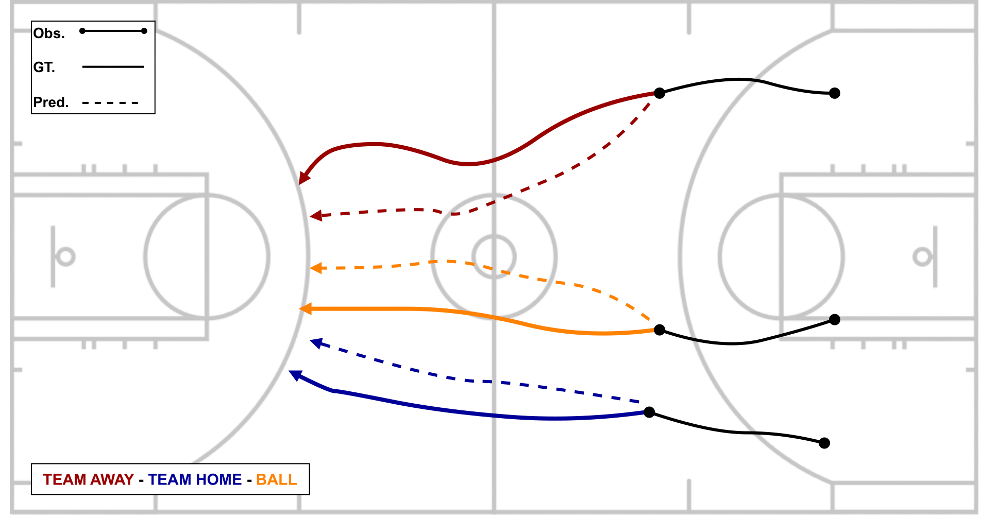

    
    

The official PyTorch implementation of the **AI4ABM ICLR '23 Workshop** paper [About latent roles in forecasting players in team sports
](https://arxiv.org/abs/2304.08272).

Visit our [webpage](https://www.pinlab.org/aboutlatentroles) for more details.

## The code will be released shortly
